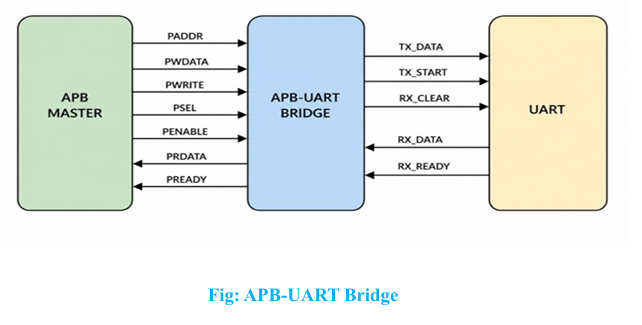
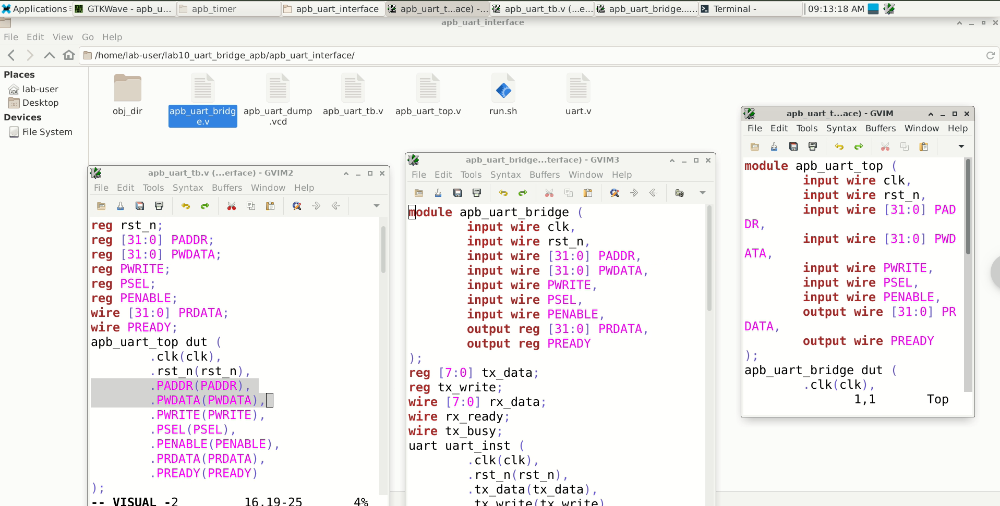

# APB-UART Bridge IP

An industry-standard implementation of an APB-to-UART bridge designed for SoC (System-on-Chip) and embedded designs. This repository models an Advanced Peripheral Bus (APB) interface communicating with a simplified UART model using memory-mapped register access.

---

## Repository Structure

```
├── .github/
│   └── workflows/
│       └── verilog_ci.yml      # CI workflow for RTL linting & simulation testing
├── rtl/                        # Synthesisable RTL source files
│   ├── uart.v                  # Simplified UART peripheral model
│   ├── apb_uart_bridge.v       # APB protocol handler and register decoder
│   └── apb_uart_top.v          # Top-level integration wrapper
├── tb/                         # Verification testbench environment
│   └── apb_uart_tb.v           # Testbench with APB task drivers
├── sim/                        # Simulation and compilation configurations
│   └── run.sh                  # Simulation script for Verilator / GTKWave
├── syn/                        # ASIC/FPGA Synthesis configurations
│   ├── constraints.sdc         # Synopsys Design Constraints (SDC) (clock, delay, jitter)
│   └── synthesize.tcl          # Yosys synthesis script template
├── docs/                       # Project documentation and architectural assets
│   ├── apb_uart_block_diagram.png  # Functional block diagram
│   ├── gtkwave_screenshot.png       # Simulation waveform screenshot
│   ├── apb_uart_infographic.png    # Comprehensive design infographic poster
│   └── apb_uart_spec_document.png  # NIELIT specification sheet
├── .gitignore                  # Git exclude list for simulation dumps & objects
├── run.sh                      # Root-level simulation convenience script
├── LICENSE                     # MIT License file
└── README.md                   # Documentation and usage guide
```

---

## Architecture Block Diagram



---

## Register Map

Memory-mapped registers decoded by the APB Bridge on a 32-bit address bus:

| Address | Access | Name | Description |
| :--- | :---: | :---: | :--- |
| `0x00` | **WRITE** | `TX_DATA` | **Transmit Data Register**: Write byte data to be transmitted to UART. |
| `0x04` | **READ** | `RX_DATA` | **Receive Data Register**: Read the last received byte from the UART. |
| `0x08` | **READ** | `STATUS` | **Status Register**: Read current UART flags (`[1] = tx_busy`, `[0] = rx_ready`). |

### Status Register Layout (`0x08`):
```
 31                                                                    2        1          0
┌───────────────────────────────────────────────────────────────────┬────────┬──────────┬──────────┐
│                             Reserved                              │Reserved│ tx_busy  │ rx_ready │
└───────────────────────────────────────────────────────────────────┴────────┴──────────┴──────────┘
```

---

## Simulation Waveforms (GTKWave)

The simulation testbench generates the VCD file which can be viewed in GTKWave, illustrating the correct APB read/write transaction handshakes and UART loopback timing.


---

## Comprehensive Design Infographic

Refer to the complete design specification poster for architectural features, applications, and register mapping details:



---

## Simulation Timing Flow

### 1. APB Write Transaction (TX)
* **Setup Phase**: Master drives address `PADDR = 0x00`, `PWRITE = 1`, `PSEL = 1`, and data `PWDATA = data`.
* **Access Phase**: Master asserts `PENABLE = 1`. The Bridge asserts `PREADY = 1`, capturing the byte data to `tx_data` and asserting `tx_write` for one cycle to trigger the UART.

### 2. UART Transfer Logic
* Upon asserting `tx_write`, the UART peripheral captures `tx_data` into `tx_reg`, sets `tx_busy = 1`, loopbacks the data to `rx_data`, and pulses `rx_ready = 1`.

### 3. APB Read Transaction (RX)
* **Setup Phase**: Master drives `PADDR = 0x04` or `0x08`, `PWRITE = 0`, `PSEL = 1`.
* **Access Phase**: Master asserts `PENABLE = 1`. The Bridge asserts `PREADY = 1`, returning the decoded register contents (`rx_data` or `status`) on `PRDATA`.

---

## Verification & Simulation Instructions

The simulation workspace uses **Verilator** to compile the testbench and **GTKWave** to analyze the VCD waveforms.

### Prerequisites
Make sure you have Verilator, make, and GTKWave installed in your environment.
```bash
sudo apt-get install verilator gtkwave make
```

### Running the Simulation
Execute the automated simulation script from the repository root:
```bash
chmod +x run.sh
./run.sh
```

Alternatively, run from the `sim/` folder:
```bash
cd sim
chmod +x run.sh
./run.sh
```

This compiles the testbench, executes the APB simulation model, outputs formatted transcript reports to console, and opens GTKWave to display `apb_uart_dump.vcd`.
